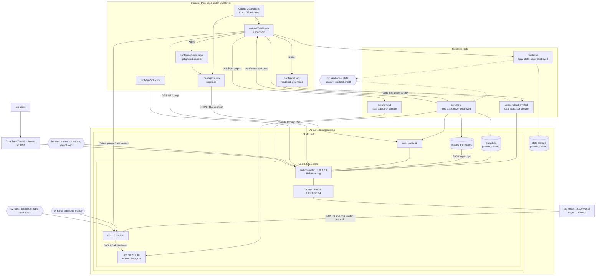

# Architecture review, 2026-09-17

A self-audit of this repository at `main` `52042d3`, asked for by the
operator with one instruction: be honest. It covers how the kit is built,
how far it scales, how readable it is, and whether it follows ordinary good
engineering practice, documentation and tone included.

Four reviewers worked in parallel and read-only, each with a different
brief, and their claims were spot checked before anything went in here.
Where a number or a behaviour was confirmed by running something, the text
says so. Where it rests on reading alone, it says that too.

## The short version

The design is sound and the discipline shows in the numbers. The Terraform roots split
by lifetime is the right idea, the fork is kept small and marked, the ADRs
are honest, and the code follows its own style rules better than most
repositories follow theirs. Nothing here is badly over-built.

The weakness is everything that is supposed to catch a mistake. No git hook
is installed, there is no CI, and the agent's settings deny nothing, so the
rules in `CLAUDE.md` hold only while whoever is typing remembers them. The
bash tests mostly prove what a script would print, never what it does with
a real answer from `az`, `ssh`, or `curl`, and every live bug of the last
week came through that gap. The part of the build that involves ISE and the
directory has never run from nothing without a hand repair. Secrets sit in
a folder that a cloud sync client uploads. About a third of the prose is
fossil.

It is a good one-person lab kit with a thin safety net. Most of what would
thicken the net is an afternoon's work, and the list at the end is ordered
that way.

## How it was reviewed

| Lens | Skills | What the bundled tools were worth |
|---|---|---|
| Code review | `code-reviewer`, `adversarial-reviewer` | `code_quality_checker.py` reads Python only. 3,668 lines of bash, the PowerShell, and the Terraform were invisible to it, and most of what it flagged was "magic number" on test ports. The bash was measured by hand. |
| Architecture | `senior-architect`, `terraform-patterns`, `azure-cloud-architect`, `cloud-security` | None for the three `senior-architect` tools: they look for MVC layers and `package.json`. One scored coupling at 0 because it could not see the real dependency chain. The Terraform security scanner gave 100 out of 100 to all four roots because its rules are written for AWS. Read that score as "not applicable". |
| Documentation and tone | `humanizer` as the detector | Useful. Pattern counts are below. |
| Over-engineering and stack | `ponytail-audit`, `tech-stack-evaluator` | The audit format worked. The stack evaluator's scripts score web frameworks by GitHub stars; only its method was used. |

Two findings were proven by running the code against local fakes: the lab
export that reports success with no labs, and a `die` that is not
fatal inside a command substitution.

## Scorecard

| Dimension | Grade | One line |
|---|---|---|
| Central design, roots by lifetime | A- | The blast radius is structural, and the teardown script cannot name the precious roots |
| Code against its own style rules | A- | 0 of 138 bash functions over 40 lines, 0 bash 4 constructs, 0 of 219 Python signatures without hints, 34 of 34 Terraform variables described and typed |
| Fork hygiene | B+ | About 110 changed lines in upstream files, every patch marked and tied to an ADR |
| ADR discipline | B+ | High quality, amended honestly. Five real decisions have none, three are contradicted by the code |
| Lessons log | B+ | 55 entries, searchable by symptom, retracts its own mistakes |
| Tone and voice | B+ | One recognisable voice. Zero em-dashes, curly quotes, or emoji in 17,000 lines |
| Security hygiene in code | B | Secrets kept off command lines and written 0600 with care. Two real gaps |
| Comments in code | B- | Mostly explain why. Also carry 39 plan task numbers, 27 dated war stories, and 6 statements that are now false |
| Orchestration | B- | Small scripts, shared helpers, dry run everywhere. Ordering lives in filenames and prose |
| Tests | C+ | Python tests against fake servers are real. Bash tests check the printed plan. One file cannot fail |
| Error handling and failure modes | C | Good patterns exist beside three ways to lose work or strand a bill |
| Reproducibility | C | The CML half is proven from zero. The ISE and directory half never has been |
| Documentation volume and currency | C- | Twice as much prose as code, half of it fossil, about 25 statements now wrong |
| Enforcement of the rules | D | Prose only |

Scalability, axis by axis:

| Axis | Grade | What limits it |
|---|---|---|
| More labs and topologies | B- | The `labs/` and `verify/` convention scales. One transit /24, one edge at `10.100.0.2`, and one hardcoded NAD mean one ISE-dependent lab at a time |
| More servers beside CML | C+ | The directory cost a root, a script pair, a test, an env file, and two documents. ISE uses a second, imperative pattern. A fourth server would make three |
| More operators | D | Local state in three of four roots, secrets on one Mac, role assignments bound to the current user. ADR 0004 says so plainly |
| More subscriptions or regions | C | Addresses and region are variables. Resource names and the state account are literals, so one environment per subscription |
| A bigger CML | B up, F out | Any VM size works. Clusters are blocked by the routed design itself: one layer 3 hop, one route next hop, one bridge on one host |
| The agent-driven model | C- | Correctness rests on a rules file and a careful agent |

## What is built well

These are worth naming because they are the parts to keep when other things
change.

The lifetime split (ADR 0002, ADR 0010). Bootstrap and persistent are never
destroyed, CML and the directory are destroyed every session, and the split
is by Terraform root, not by a lifecycle flag someone could remove. The
persistent root hands values down one way only: `terraform output -json`,
read by `tf_out` in `scripts/lib/common.sh`, into rendered YAML for the fork
or `-var` arguments for the directory root. There are no remote state data
sources, which keeps the fork ignorant of this repository. That was the
right call.

The fork. `git describe` gives `v2.9.0-20`. Of 626 inserted lines, 517 are
three new files that cannot conflict with upstream. The rest, about 110
lines, sits almost entirely in one file, each block under an
`azure-lab fork:` comment with an ADR number. New behaviour hides behind
`try()` so an upstream config still validates. `AZURE-LAB.md` explains the
per-NIC expansion of the `VirtualNetwork` tag better than Microsoft does.

Verifying the outcome instead of the exit code, where it matters most.
`scripts/40-down.sh:39-61` runs the license release with `|| true`, then
reads the license status back, retries through the API, and refuses to
destroy on anything but `NOT_REGISTERED`, `UNKNOWN` included. A stranded
Smart License is the failure that costs money here, and the script is
designed around it. `scripts/90-smoke-test.sh` has seven `|| true`, and every one is
followed by an exact comparison that fails closed.

The dry-run wrapper. `run()` prints or executes the same argument list, so a
dry run exercises the real argument construction, and
`parse_dry_run_only` dies on an unknown flag so `--dryrun` cannot run for
real. (This same wrapper is also the root of the testing problem below. Both
are true.)

Secrets in code. Passwords travel by environment or stdin and never on a
command line. Private files are created with `O_EXCL` at 0600, with the
reason written beside the code (`scripts/lib/render_cml_config.py:113-130`).
SSH uses a repo-local `known_hosts` with `accept-new` and a deliberate forget
step per rebuild, which is trust on first use done on purpose instead of
host key checking switched off. `run-as-admin.ps1` restricts its directory
before writing the arguments file and removes it in a `finally`.

The ADR 0010 amendment for the domain controller's SAM policy. A vendor
field notice proven on a version it does not list, with the DC's own audit
events as evidence, the operator's approval, the risk bounded, and an exit
condition. That is what an accepted-risk record should look like. One of its
stated bounds is wrong, which the security section covers.

The honest documents. `BUILD-FROM-SCRATCH.md` marks what has never been
proven and ends with a table of what is code and what is still by hand.
`LESSONS-LEARNED.md` uses the symptom as the heading, which makes it
searchable, and it retracts its own earlier wrong diagnoses in place.

## The central weakness: nothing enforces the rules

Checked directly:

- `.git/hooks/` holds only samples and `core.hooksPath` is unset.
  `.pre-commit-config.yaml` defines gitleaks, shellcheck, and
  `terraform_validate`, and none of it runs unless someone types
  `pre-commit run`. For 235 commits that someone was the agent, by hand.
- There is no `.github/` directory. CI is out of scope in `CLAUDE.md`.
- `.claude/settings.json` has 55 allow rules and no deny rules. It allows
  edits under `config/`, which includes the gitignored secrets, and nothing
  denies reading `keys/`, `config/mcp-env/`, or a state file.
- The stop-and-ask list in `CLAUDE.md` depends on the harness asking by
  default. On 2026-09-17 it was the platform's own permission classifier,
  not any rule in this repository, that stopped a security setting from
  being changed on the domain controller.

214 of 220 non-merge commits are agent co-authored, and the last four pull
requests were merged within hours with no independent check. "Tests pass" is
self-attested by the author of the change.

This is cheap to fix and the fixes are listed at the end. It is also the
operator's decision, because it means editing `.claude/settings.json` and
adding a `.github/` directory, both of which `CLAUDE.md` puts on the ask
list or outside the layout.

## Tests prove the plan, not the behaviour

The Python tests exercise behaviour: `test_ise_config.py`, `test_users.py`,
`test_gen_testbed.py`, and `test_cml_remote.sh` drive real code against
local HTTP servers.

The bash tests are a different thing. `run()` echoes under `DRY_RUN`, and the
riskiest functions return early before their real branch:
`wait_for_ise_ready`, `clear_failed_run_commands`, `dc_check`,
`release_license`, the delete ordering in `45-ise-down.sh`. So the suite
proves what would be printed and never touches the code that parses an
answer. ROADMAP item 21 already lists four live bugs in two days that the
tests could not have caught. 2026-09-17 added two more of the same kind: a
JMESPath filter that silently skipped a billing disk, and a pipe that hid a
failed teardown. Both were written by the agent that wrote this review.

Specifics:

- `tests/test_transit.sh` ends with an unconditional
  `echo "test_transit: all passed"`. It is the only one of 16 bash tests
  that never calls `finish`, so its forty or so assertions increment a
  counter nobody reads. Confirmed.
- About 25 to 30 assertions grep the repository's own source for a string.
  The regression test for the skipped disk pins the text
  `az resource list --resource-group` and the absence of one bad filter; any
  other silent filter passes. One assertion checks that
  `if ($LASTEXITCODE -ne 0)` appears once in a PowerShell file, and passes
  while five other native calls in the same files go unchecked.
- `tests/stubs/az` matches a query as a literal string and returns all five
  rows whatever the query says. It cannot evaluate JMESPath, so that whole
  class of bug is undetectable by construction. Its fixture names no longer
  match what `25-ise-up.sh` tags.
- No test runs 24, 25, 40, 45, or 46 with dry run off against stubs, so
  abort midway, ordering, and rerun behaviour are untested.
- The two `verify/*/verify.py` files, 341 lines whose string parsing decides
  whether a lab passes, have no tests at all.
- `tests/run.sh` returns a real exit code, but runs shellcheck at
  `--severity=warning`, so the "quote every variable" rule is not actually
  enforced, skips shellcheck with a warning if it is missing, and is not
  called from pre-commit.

The fix that pays is not a rewrite. Run the scripts with dry run off against
stub `az`, `ssh`, `curl`, and `terraform` that return canned output,
failures included. A Python rewrite that still shells out to the same four
tools would keep every one of these bugs.

## Failure modes that lose work or leave a bill

Ranked by cost.

1. The lab export reports success with no labs when the API fails, and then
   the VM is destroyed. `scripts/lib/cml-remote.sh:71,79,98` loop with
   `for id in $(lab_ids)`. Bash throws away the exit status of a command
   substitution in a `for` list, so strict mode never sees the failed call.
   Run against a fake that returns HTTP 500 on `/labs`, the real script
   printed "exported 0 labs" and exited 0. `40-down.sh` takes that as
   permission to destroy. `tests/test_cml_remote.sh` asserts "exported 0
   labs" as a success case. Fix: assign first (`ids="$(lab_ids)"`, which does
   propagate failure), loop after, and have `40-down.sh` refuse when the
   exported count differs from the lab count.
2. `45-ise-down.sh` deletes in an order Azure can reject and never checks
   the result. Its comment says the NIC, NSG, disk, and public address can
   go in any order once the VM is gone. They cannot: `25-ise-up.sh` attaches
   the NSG to the NIC, and Azure refuses to delete an NSG or a public address
   still bound to one. Row order comes from `az resource list` and is not
   guaranteed; the 2026-09-17 teardown worked because the order happened to
   be kind. It also prints `[OK]` without listing again, which is the real
   root cause of the skipped disk, whatever the filter says. Fix: three
   passes by type, then list again and fail if anything is left.
3. A half-built CML VM cannot be torn down by the scripts. `20-up.sh`
   refuses if the VM exists. `40-down.sh` needs the export, the export needs
   the API, and `cml.env` is written only at the end of a successful build.
   So the most common reason to tear down, a build that failed after the VM
   was created, leaves only a hand `terraform destroy`, which is on the ask
   list. Fix: a `--skip-export` flag that demands the VM name be typed.
4. `scripts/lib/users.py` loses generated passwords on a partial failure. If
   user 5 of 20 fails, users 1 to 4 exist in CML with passwords nobody
   holds, and a rerun leaves them alone. On success it rewrites the
   credentials sheet with only this run's users, so adding one person
   deletes the other twenty passwords. Fix: write each row as it is created,
   and append.
5. A `die` inside a command substitution in argument position is not fatal.
   Proven: `ad_tf_args` in `24-ad-up.sh` produced five empty `-var=` lines
   and exit 0 with the persistent outputs unreadable. `24-ad-up.sh` and
   `20-up.sh` are saved only because an earlier plain assignment happens to
   die first. `46-ad-down.sh` has no such call, so it would run
   `terraform destroy` with empty variables, remove `ad.env`, and print
   `[OK]`. Fix: resolve into variables first, build the list after.
6. `terraform destroy` reads a gitignored rendered file. A rename in the
   fork while a VM was up broke the 2026-09-17 teardown, and the recorded fix
   is "remember to edit the generated file". Fix: render `config/cml.yml`
   again at the top of `destroy_cml`, and have preflight fail when it names a
   customize script that does not exist.
7. The persistent root is applied every session with `-auto-approve` after a
   prompt that shows no plan. `prevent_destroy` covers the data disk and the
   state account only. The static public address (which the allow lists, the
   MCP server, and DNS depend on) and the storage account holding about 30 GB
   of images and every export are unprotected against a forced replacement.
   `README.md` says the guarantee is "verified by a test"; no test mentions
   `prevent_destroy`. Fix: add it to those two resources, and plan with
   `-detailed-exitcode` before applying.
8. Smaller ones: the DNS readiness check in `24-ad-up.sh:121` prints
   `dns-ok` whether or not anything resolved, because `Resolve-DnsName`
   failures do not terminate. Five PowerShell native calls (`certutil`,
   `dsacls` three times, `icacls`) discard their exit codes, in files whose
   own comment records losing a failure that way; if the `icacls` one fails,
   the arguments file holding two passwords is written with inherited
   permissions. `25-ise-up.sh:143` turns any SSH failure into "still
   waiting", so a dead jump host looks like 45 minutes of ISE booting, and its
   port forward lacks `ExitOnForwardFailure`, which `50-tunnels.sh` already
   gets right. Dry runs of 40, 45, and 46 print `[OK] ... destroyed`.

## Security and privacy

None of this is an emergency. All of it is cheap to fix.

The leaked CML passwords were never rotated, and `STATUS.md` says they were.
Early on 2026-09-17 a broken masking command printed the rendered CML
secrets into an agent session. The status entry written after the next
teardown claims the teardown destroyed the `random_password` resources and
the next build would rotate them. It did not. Both passwords are defined in
`terraform/persistent/main.tf:166-174`, which is never destroyed, and
`20-up.sh:98-99` reads them from its outputs every build. The same two
passwords were reused for that day's rebuild and will be for the next.
Exposure today is nil because no VM exists. Before the next build:

    terraform -chdir=terraform/persistent apply \
      -replace=random_password.app_admin -replace=random_password.sys_admin

That is an apply on a root that is never destroyed, so it waits for the
operator. ADR 0004 already names it as the rotation procedure.

The repository lives inside a OneDrive folder. `.gitignore` protects git and
nothing else. `keys/cml-lab` (generated with no passphrase),
`config/mcp-env/*.env`, `config/cml.yml`, and the local state files,
including the directory root's with four passwords, all sit in a tree a sync
client uploads. ADR 0010 says that state is protected "only by `.gitignore`
and the Mac's disk", which is not accurate here. OneDrive has also caused two
recorded operational failures. Moving the repository out is a relocation,
not a redesign, and it removes both problems. Whether sync is excluding those
files could not be checked.

The repository is public. Checked with `gh repo view`. Tracked files carry
the lab's static public address (`docs/STATUS.md`,
`docs/LESSONS-LEARNED.md`), a VPN exit block, colleagues' usernames and a
personal email address (`docs/STATUS.md`, `docs/ACCESS.md`,
`docs/STATUS-ARCHIVE.md`), and the state storage account name. None is a
credential: the address answers only to an allow-listed source and the
storage account needs a key. It is still more than a public repository
should say about a lab and the people who use it, and
`BUILD-FROM-SCRATCH.md:21` promises the opposite. Scrubbing the files fixes
the present; the history keeps the past unless it is rewritten, and
rewriting pushed history is the operator's call.

TLS verification is off toward CML across the internet, with no ADR.
`20-up.sh:149` hardcodes `CML_VERIFY_SSL=false`, and the admin password then
travels from the Mac to a public address unverified, from `users.py`,
`gen_testbed.py`, `60-import-lab.sh`, and the MCP server. The NSG limits who
can connect, not who sits on the path. Compare ISE, where the same setting
rides inside an SSH forward with a pinned host key and the reason is written
down. The cheap fix is the one already modelled in `50-tunnels.sh`: point
`CML_URL` at a forward.

The MCP server is unpinned and holds admin credentials.
`scripts/mcp-cml.sh:34` runs `uvx "cml-mcp[pyats]"`, which resolves the
newest release from PyPI at every launch. Pinning a version is one token and
closes the largest supply chain exposure in the repository.

pyATS writes outside the repository. `80-verify-lab.sh:90` gives easypy no
archive directory, so it uses `~/.pyats/`, which exists on this Mac with one
archive in it. By `verify.py`'s own comment the archive holds the test
password in clear text. That breaks the "never create files outside this
repo" rule that `10-upload-images.sh` went out of its way to honour for
azcopy. The comment names `verify/.archive`, which nothing configures and
`.gitignore` does not cover.

The network policy is mostly Azure's defaults. There is no subnet NSG, and
both rules on the domain controller's NSG allow what `AllowVnetInBound`
already grants, a point the repository's own lessons make. In practice the
whole VNet and all of `10.100.0.0/16` reach the DC on every port, RDP
included, while it runs the relaxed SAM policy. The ADR 0010 amendment lists
as a bound that the NSG "admits only `snet-apps` and RDP from the CML host",
which the same ADR contradicts. CML has peer and student accounts, so "lab
nodes" includes other people's. Residual risk is low for a session-lifetime
lab with generated passwords. Correct the bound, and add one deny for 3389
from the VNet except the CML host so the RDP rule means something.

Fixed during this review: `config/mcp-env/ise.env` was mode 0644 while its
siblings were 0600. It is 0600 now. No script creates that file, which is why
nothing enforced it.

## Scalability

More labs: fine. Lab YAML with placeholders, a renderer, and a verify
directory per scenario is a convention that holds. The limit is the routed
path: one transit /24, the lab edge fixed at `10.100.0.2` in the fork's
script, `NAD_IP_ADDRESS = "10.100.0.2"` as a constant in `ise_config.py:70`,
and `10.100` addresses hardcoded three times in the smoke test, while
`lab_summary_cidr` pretends to be a variable. Two labs that both need ISE
collide. When the second one arrives, carve a /24 per lab behind one shared
edge and make the NAD list data, the way `ad-identities.csv` already is.

More servers: each one is expensive. The directory cost about 650 lines
across a root, two scripts, a test, an env file, and two documents, and ISE
is managed by a second pattern entirely (portal, imperative `az`, tag
sweep). ISE's address is written in four places that must agree by hand.
`46-ad-down.sh` sources `24-ad-up.sh` to borrow one function. Before a third
server, extract the apply and destroy wrapper into `scripts/lib/` with the
root as an argument, and make the apps-subnet addresses outputs of the
persistent root. A generic VM module is not worth it for two servers.

More operators: not without rework, and the repository says so. Revisit when
a second person joins, as ADR 0004 already plans.

Clusters: state in the roadmap that a cluster means redesigning ADR 0003,
not lifting a scope line. Vertical headroom is free and is the right answer
for this lab.

The cost the design does not optimise: ISE. The architecture is built around
a CML rebuild that takes about twenty minutes. `BUILD-FROM-SCRATCH.md`
budgets two to three hours for the rest, most of it waiting for ISE, plus a
hand portal deploy and a hand domain join every session. Two options deserve
a decision before Phase 2 code lands: stopping and deallocating ISE and the
DC between sessions instead of deleting them (disk rent and the 90 day
evaluation clock, against an hour or more per session and the least tested
code in the repository), and choosing one ISE policy layer before
`ise_config.py`, 332 lines for two object types, grows to cover ten more.

## Readability and documentation

The numbers: about 17,200 lines of tracked Markdown against 10,650 lines of
code, tests and lab YAML included. That is 1.6 to 1 overall and 2.2 to 1
against non-test code. 116 of 235 commits are `docs:`.

Half of it is fossil. `docs/superpowers/` is 8,361 lines, 49 percent of all
Markdown, and one archived plan is 5,302 of them; its own banner says its
contents have diverged and to read the real files. The trustsec and pyATS
plans show 0 of 31 and 0 of 30 boxes ticked for work that shipped. Four
specs for shipped work still say "draft", and one says "still not built"
about something built and torn down the same day.

The entry points are stale. `README.md` describes the project as of
2026-09-10: three roots, no directory, no ISE, a different project name
(`cml-phoenix` against `cml-azure-lab` everywhere else).
`PREREQUISITES.md` is the owner's completed checklist ("already valid on
this Mac", every box ticked), not a prerequisites document, and omits what
`BUILD-FROM-SCRATCH.md` phase 0 had to add.

`STATUS.md` has become a diary. A new session is told to read it first and
gets 927 lines, including a retired lab's bring-up and a superseded 45 line
pickup list. Its archive rule is a date, so it never prunes. It needs a
"current state" block of at most 60 lines at the top, rewritten each
session, with everything older than two sessions archived.

The same stories are told in full six to eight times: the Server 2025 join
problem in seven places, the ISE DNS repoint in six, the second `svc-ise`
grant in four. They agree today because they were all written on one day.
They will drift. The authoritative homes are clear (the ADR for the
decision, `ISE-AD-BUILD.md` for procedure, `AZURE-LAB.md` for the routed
path, `BUILD-FROM-SCRATCH.md` for order); the other copies should shrink to
pointers, which `BUILD-FROM-SCRATCH.md` already does well.

About 25 statements are now contradicted by the code or a later document.
The reviewer's list has file and line for each, and the ones that matter
most are the password rotation claim, "three roots" in `README.md` and
ADR 0002, preflight validating three roots while `CLAUDE.md` says four,
ADR 0006 claiming two placeholders where labs use ten, ADR 0008 describing
an NSG the code no longer creates, and six code comments that contradict the
code beside them (for example `25-ise-up.sh:122` against `:127`, and
`ise_config.py:146` against its own docstring).

Tone. The mechanical house style held completely, which is rare. The voice
is consistent and plain. It has also grown its own tics, which are the new
tells: ", not X" 116 times, "real" or "really" 119 times, "by hand" 77,
"the operator" 92, "proven" 40. It breaks in three places: `STATUS.md`
(first person slips, one unwrapped 1,500 character paragraph), the two
`deep-dive/` files (essay voice, 22 negative parallelisms in one), and
`USER-GUIDE.md`. The opposite failure is present too: `STATUS.md` assumes a
reader who was in the sessions (sw1, emp-pc, the probe lab, the classifier,
PR numbers) and has no glossary.

Comments. A quarter of non-blank source lines are comments, and 31 of 47
files cite an ADR, which is what the rules ask for. Roughly three quarters
explain why (an estimate from the blocks read). The rest narrate
history: 39 to 41 "Task N" references to plans that are now fossils, one
inside a `die` message, 27 dated "caught live" stories, skill names in
source. `ise_config.py` opens with a 53 line docstring that is a changelog,
and already contradicts itself. The contract and the reason belong in the
source; the story belongs in git and the lessons log.

A newcomer following `README.md` gets CML built and probably the directory
and ISE, from `BUILD-FROM-SCRATCH.md` alone. The first gaps: the README
sends them to two stale documents first; after editing the tracked
`backend.tf` they do not know whether to commit it; `ips-ha.yaml` needs a
Kali image and a Security Cloud Control tenant no guide explains; the lab
that proved everything cannot be imported; and the ISE join is a set of raw
API calls to assemble by hand.

## Over-engineering

Not much. Every function in `common.sh` has callers, every Python function
is referenced, every variable in the example files has a reader. The cuts
are duplication and speculative structure, about 870 lines and no
dependencies. The largest:

- `config/cml.tfvars` is never given to Terraform. It is a lookalike that
  needs a 90 line regex parser and a 60 line test. A JSON file read with
  `json.load` and `jq` removes about 150 lines.
- 240 lines implement an MCP stdio client for one smoke check that the API
  check already covers, including an argument path with no callers.
- A second fake CML API (123 lines) reimplements two routes of the first.
- Three copies of the same urllib JSON client and four ways to write a
  private file, one of which does the thing another's comment warns against.
- Three subnets "reserved for FTDv" with no consumer, since FTDv runs inside
  CML now, and two outputs nobody reads.
- `--post-deploy`, a mandatory flag with one mode.
- `20-up.sh` calls `terraform output -json` against the blob backend about
  16 times where once would do, which also costs about a minute per build.
- Migration code in the fork for a bridge that cannot exist on a fresh VM.

## Stack verdicts

| Choice | Verdict | Confidence | Strongest argument against |
|---|---|---|---|
| Bash 3.2 for orchestration | Fix the test seam first, then move four scripts to Python | Medium | Two idioms may be worse than either one |
| Terraform, four roots, mixed state | Keep | High | Bicep deployment stacks need no state file, but the fork is Terraform |
| Fork as a submodule | Keep, with an exit trigger | Medium | Upstream is nearly dormant, so the submodule buys little and keeps 434 lines of our own scripts outside our tests |
| Stdlib-only Python | Keep, one exception | Medium | It costs about 300 lines. `gen_testbed.py` should run in the pyATS venv and parse YAML properly |
| pyATS for verification | Keep, be honest about it | Medium | `verify.py` uses no Genie parsers and string-matches output, which is what ADR 0009 rejected |
| Secrets in env files and state, no Key Vault | Keep the design, move the location, reopen the question | Medium | ADR 0004 weighed three strings. There are about ten now, across five env files and three state files |
| ISE policy from stdlib Python | Decide roadmap item 22 now | Low to medium | The client is proven live, and any tool meets the same ERS quirks |
| PowerShell by run command | Keep | Medium | Deallocating the DC instead of destroying it would remove the need |
| No CI | Add one small job | High | CI reruns the same tests that missed every live bug, so the seam matters more |
| Markdown in the repo | Keep, trim the session-start load | Medium | The lessons log is the agent's memory, and trimming it is a false economy |

On the Python rewrite (roadmap item 21, tabled): tabling it was right. Three
of the four bugs it cites sit at a process boundary, and Python that shells
out to `az`, `ssh`, and `terraform` keeps all three. Fix the test seam, then
move only the scripts that are mostly logic, polling, or JSON, in this
order: `25-ise-up.sh`, `45-ise-down.sh`, `00-preflight.sh`,
`60-import-lab.sh`. Leave 20, 40, 24, 46, 30, and 50 as thin bash; a
sequence of `terraform` and `ssh` calls with a `+ cmd` transcript is what
bash is for.

## What to do, in order

An afternoon, mostly one-liners:

1. Rotate the two CML passwords before the next build. Operator's apply.
2. `pre-commit install`. Operator's decision, since it changes how commits
   behave.
3. Pin `cml-mcp` to a version in `scripts/mcp-cml.sh`.
4. Fix the export loop in `cml-remote.sh` and make `40-down.sh` compare
   counts. Add the failing-API test.
5. Make `test_transit.sh` call `finish`.
6. Give easypy an archive and runinfo directory under `verify/`, and ignore
   them. The `.gitignore` edit needs the operator.
7. Add `prevent_destroy` to the public address and the lab storage account.
   Operator's apply.
8. Correct the false `STATUS.md` rotation claim and the wrong bound in the
   ADR 0010 amendment.

A day or two:

9. `45-ise-down.sh`: delete in three passes by type, list again, fail on
   leftovers. End every down script with a listing of the resource group
   against the persistent set.
10. `--skip-export` for `40-down.sh`, and render `config/cml.yml` again
    before destroy.
11. Resolve outputs into variables before building argument lists in
    `24-ad-up.sh`, `46-ad-down.sh`, and `20-up.sh`.
12. One `Invoke-Native` helper for the six PowerShell native calls, and
    `$ErrorActionPreference='Stop'` in the DNS check.
13. `users.py`: write each credential as it is created, and append.
14. A deny block in `.claude/settings.json` and a fifteen line GitHub Actions
    job running `tests/run.sh` and gitleaks. Both are the operator's to
    approve, since `CLAUDE.md` guards the first and excludes the second.
15. Send CML API traffic through an SSH forward, and write the ADR.
16. Documentation: delete the 5,302 line archived plan, archive executed
    plans with one line each, give every spec a status, rewrite the README's
    fifteen stale lines and pick one project name, turn `STATUS.md` into a
    current-state block plus a log, strip task numbers and dated stories
    from source comments.
17. Decide whether the repository should be public. If yes, scrub the
    address, the VPN block, and the names from tracked files.

Before Phase 2:

18. Make the next build a proving run and nothing else: no other work until
    the smoke test and a domain join pass without touching a host. Record the
    result. Five things have never run in a clean build.
19. Run the numbered scripts with dry run off against canned stubs. This is
    the single change that would have caught the most bugs.
20. Teach `ise_config.py` the join, the groups, and the second NAD, or
    choose a different policy layer first.
21. Move the repository out of OneDrive, or write the ADR that accepts it.

Not worth doing: a generic VM module or Terragrunt, remote state for the
session roots, plan and apply pipelines or OIDC to Azure, per-port rules for
Active Directory, Key Vault while there is one operator and the repository
has left OneDrive, multiple transit bridges, a full bash to Python rewrite,
Ansible as the orchestrator.

## System diagram

Drawn from the code. Hand steps are the hexagons.

## What was not checked

- Nothing live in Azure: effective NSG rules, role assignments, whether the
  persistent plan is empty. No `az` or `terraform plan` ran as part of the
  review.
- Whether OneDrive is set to exclude the gitignored files.
- How Azure's run-command agent passes protected parameters. If it puts them
  on the PowerShell command line, the transcript header in
  `C:\lab\log\10-promote-forest.txt` would hold the recovery password. It is a
  one minute look on the next build.
- The contents of any secret, key, or state file, by instruction. Existence
  and file modes only.
- Azure's delete ordering, `Add-ADGroupMember` on a rerun, and the ISE
  Terraform provider's coverage were read about and never run.
- Upstream cloud-cml beyond the local refs. Nothing was fetched.
- The reviewers did not run `tests/run.sh`, because it writes temporary files
  inside the repository. It passed when this document was committed.
- Line counts for possible cuts are estimates. Nobody made a trial diff.
